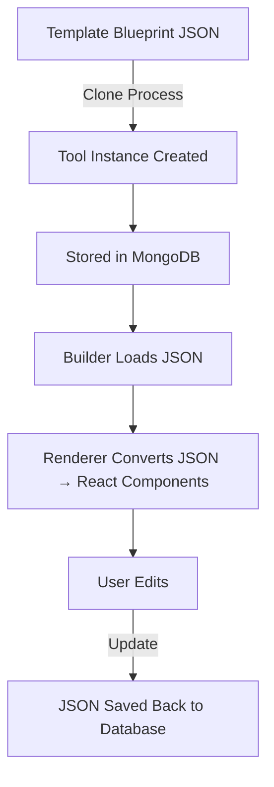

# 🚀 CodeAra – Micro SaaS App Builder

**CodeAra** is a multi-tenant SaaS platform that allows users to create, customize, and deploy micro SaaS applications (Mini-SaaS) using predefined templates and a dynamic JSON-driven builder engine.

The platform supports template cloning, dynamic UI rendering, modular components, and secure tenant-based data isolation.

---

## � Project Overview

CodeAra empowers users to transition from ideas to deployed micro-applications rapidly. The system separates **Templates** (blueprints) from **Tools** (instances), ensuring data integrity and scalability.

- **Browse SaaS Templates**: Explore a gallery of pre-built application blueprints.
- **Preview Mode**: Test templates in a read-only environment before cloning.
- **Template Cloning**: One-click deep cloning of layouts and schemas into a personal workspace.
- **Dynamic Builder**: Edit layouts and configurations using a modular UI engine.
- **Modular Components**: Add, remove, and configure components on-the-fly.
- **JSON-Driven Engine**: Saves all configurations as structured JSON for portability and speed.
- **Multi-Tenant Environment**: Securely manage multiple SaaS tools with complete data isolation.

---

## 🏗 System Architecture

### Technology Stack
- **Frontend**: React.js, Tailwind CSS, Framer Motion (UI animation), Three.js (Interactive 3D).
- **Backend**: Node.js, Express.js, MongoDB (Mongoose).
- **Scaling**: Node.js Cluster module for horizontal scaling.

### Architecture Flow


---

## 🧱 Core Features

| Feature | Description |
| :--- | :--- |
| **Template System** | Structured JSON blueprints with 5+ pages, schemas, and sample data. |
| **Cloning Engine** | Deep clone of layout and schema; tracks activity via `TemplateClone`. |
| **Multi-Tenancy** | Secure data isolation where `tenantId` is attached to every resource. |
| **Dynamic Renderer** | Maps JSON types directly to a React component registry. |
| **D&D Builder** | Real-time layout modification with persistent state management. |
| **Admin Panel** | Comprehensive moderation for users, tenants, and marketplace items. |

---

## 📁 Folder Structure

```text
Micro-SaaS-Builder-Platform/
├── frontend/               # User-facing Dashboard & Builder
│   ├── components/         # Reusable UI library
│   ├── builder/            # JSON-driven builder logic
│   ├── templateSites/      # Read-only template preview logic
│   ├── layouts/            # Dashboard and Public layouts
│   └── hooks/              # Custom reactivity & fetching logic
├── backend/                # API Engine
│   ├── models/             # Mongoose schemas
│   ├── controllers/        # Business logic for cloning & building
│   ├── routes/             # API Endpoints
│   └── middlewares/        # Auth & Tenant isolation
└── ai-service/             # Experimental Infrastructure (Internal)
```

---

## 🗃 Database Models

### � Template
Stores blueprint configurations, including `layoutJSON`, `schemaConfig`, `routeConfig`, `defaultPages`, and `sampleData`.
### 🛠 Tool
Stores cloned instances specific to a tenant, including `tenantId`, `templateId`, and state mode (preview/live).
### 🔗 TemplateClone
Tracks cloning activity between tenants and templates for analytics and history.
### 👤 Tenant & User
Core identity models for workspace isolation and authentication.

---

## ⚙ How It Works

1.  **Browse Templates**: Users visit the gallery to find a starting point.
2.  **Preview**: High-fidelity, read-only preview using the template's blueprint JSON.
3.  **Clone**: System performs a deep clone of `layoutJSON` and creates a new `Tool` instance.
4.  **Builder**: Tool layout is fetched and fed into the **Dynamic JSON Renderer**.
5.  **Edit & Render**: Renderer maps JSON types to React components (e.g., `Card`, `Table`, `Chart`).
6.  **Save**: Updated JSON structures are persisted back to the database.

---

## 🧩 Component Registry Example
```javascript
const componentRegistry = {
  Card,
  Table,
  Chart,
  Kanban,
  Button
};
// Renderer dynamically maps JSON type to React components.
```

---

## 🛡 Security & Performance
- **JWT Authentication**: Secure user session management.
- **Tenant Isolation**: Middleware ensures no cross-tenant data leakage.
- **RBAC**: Role-based access control for admin and user routes.
- **Indexing**: Database-level indexing on `tenantId` and `slug` for high performance.

---

## 🚀 Installation Guide

### Backend Setup
```bash
cd backend
npm install
npm run dev
```

### Frontend Setup
```bash
cd frontend
npm install
npm run dev
```

### Database
Ensure MongoDB is running locally or provide a connection URI in `.env`.

---

## � Future Enhancements
- **Template Versioning**: Roll back to previous layout versions.
- **Marketplace Monetization**: Built-in payment processing for template creators.
- **White-Label Support**: Custom domain mapping for tenant tools.
- **Plugin System**: Third-party integrations via custom modules.

---

## 👨‍💻 Author
**Mohammed Ansari**  
*Engineering Student*

---

## 📄 License
This project is developed for academic and educational purposes.
