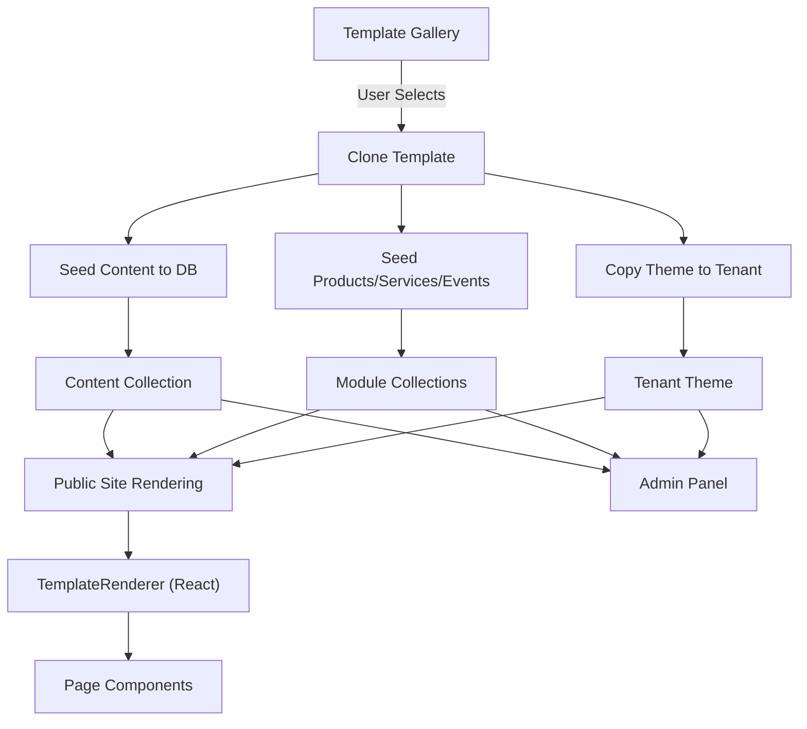

# 🚀 CodeAra — Micro SaaS Builder Platform

**CodeAra** is a full-stack, multi-tenant SaaS platform that allows users to create, customize, and deploy micro SaaS applications and websites using a **Template-Driven CMS Architecture**. 

> **From idea to deployed product — in one workflow.**

---

## 🎬 Interactive 3D Landing Page

The landing page is a cinematic, scroll-driven 3D experience built with **React Three Fiber** and **GSAP ScrollTrigger**. It tells the product story through motion:

**Idea → Build → Integrate → Launch**

| Stage | Scroll Range | Animation |
|---|---|---|
| **Hero Entry** | 0% | 3D panel floats with idle oscillation, headline + CTA visible |
| **Flatten** | 20–40% | Panel rotates flat on X-axis, camera shifts overhead |
| **Tool Integration** | 40–65% | 5 tool icons fly in and snap with spring bounce |
| **SaaS Assembly** | 65–82% | Dashboard UI materializes with glow pulse |
| **Launch** | 82–100% | Panel stands upright — complete product revealed |

**Mobile (< 768px)**: WebGL replaced with CSS-only 2D fallback hero that auto-plays.

---

## 📐 Project Overview (Template-Driven CMS)

CodeAra empowers users to build production-ready websites and micro SaaS products instantly by cloning rich, pre-configured templates. 

Instead of a complex visual drag-and-drop builder, the platform uses a **Template-Driven CMS approach**:
1. Users select a template from the gallery.
2. The template's pages, default content, theme, and module data (e.g., products, services) are cloned to the user's tenant workspace.
3. Users customize their site via a streamlined Admin Panel (Content Editor, Theme Editor, Module Manager).
4. A high-performance Template Rendering Engine serves the site to the public.

### Included Templates (10 Configured Blueprints)
**Informational Templates:**
- Portfolio, Resume, Digital Agency, Startup Landing, Product Showcase

**Functional Modules (With Backend Logic):**
- Restaurant / Food Delivery (Menu, Cart, Orders)
- Car Rental / Booking (Vehicles, Date Selection, Bookings)
- Service Booking (Services, Appointments)
- Event Management (Events, Capacity, Registrations)
- Digital Marketplace (Products, Shopping Cart)

---

## 🏗 Architecture

### Technology Stack

| Layer | Technologies |
|---|---|
| **Frontend** | React 19, Vite, Tailwind CSS, Framer Motion, React Three Fiber, GSAP |
| **State/Data** | React Context API, Axios |
| **Backend** | Node.js, Express.js, Mongoose (MongoDB), JWT Auth, dotenv |
| **Database** | MongoDB with indexed tenant isolation |

### System Architecture Diagram


```mermaid
graph TD
    A[Template Gallery] -->|User Selects| B[Clone Template]
    B --> C[Seed Content to DB]
    B --> D[Seed Products/Services/Events]
    B --> E[Copy Theme to Tenant]
    C --> F[Content Collection]
    D --> G[Module Collections]
    E --> H[Tenant Theme]
    F --> I[Public Site Rendering]
    G --> I
    H --> I
    I --> J["TemplateRenderer (React)"]
    J --> K[Page Components]
    F --> L[Admin Panel]
    G --> L
    H --> L
```

---

## 📁 Project Structure

```
Micro-SaaS-Builder-Platform/
├── frontend/                    # User-facing Application
│   └── src/
│       ├── components/
│       │   ├── templates/       # Template Rendering Engine
│       │   │   ├── TemplateRenderer.jsx
│       │   │   ├── pages/       # (GenericPage, MenuPage, CartPage, etc.)
│       │   │   └── sections/    # (HeroSection, ContactSection, FooterSection)
│       │   ├── 3d/              # Landing Page 3D Animations
│       │   └── layout/          # App Shell (Navbar, ProtectedRoute)
│       ├── context/             
│       │   ├── ContentContext.jsx  # Content fetching & caching
│       │   └── ThemeProvider.jsx   # Dynamic CSS Variables injection
│       ├── pages/               
│       │   ├── Landing.jsx          
│       │   ├── TemplateGallery.jsx  
│       │   ├── TemplatePreview.jsx  # Live preview with mock context
│       │   ├── PublicApp.jsx        # Public vanity URL renderer
│       │   └── admin/               # Tenant Admin Dashboard
│       │       ├── TenantAdminLayout.jsx
│       │       ├── ContentEditor.jsx
│       │       ├── ThemeEditor.jsx
│       │       ├── ModuleManager.jsx
│       │       ├── ContactMessages.jsx
│       │       └── SiteSettingsEditor.jsx
│       └── App.jsx
│
├── backend/                     # API Server
│   ├── controllers/             
│   │   ├── templateController.js # Template cloning, vanity URL resolution
│   │   ├── contentController.js  # JSON content chunks
│   │   ├── productController.js  
│   │   ├── orderController.js    
│   │   ├── serviceController.js  
│   │   └── eventController.js    
│   ├── models/                  # Mongoose Schemas
│   │   ├── Template.js, Tenant.js, Content.js
│   │   ├── Product.js, Order.js, Booking.js
│   │   ├── Service.js, Event.js, Registration.js
│   │   └── ContactMessage.js
│   ├── routes/                  # API route definitions
│   ├── seeders/                 
│   │   ├── seedData.js          # Master content repository
│   │   └── templateSeeder.js    # Initialization script
│   └── server.js
```

---

## 🗃 Database Models

| Model | Purpose |
|---|---|
| **Template** | Blueprint definitions: `modules`, `pages`, `theme`, and `defaultContent` |
| **Tenant** | Workspace isolation — every resource is strictly scoped to `tenantId` |
| **Content** | Flexible key-value store mapping `(page, section)` to JSON data |
| **Product / Service / Event** | Custom collections for functional template modules |
| **Order / Booking / Registration** | Transaction records submitted from the public templates |
| **User** | Authentication with JWT, profile management |

---

## 🛡 Security & Performance

| Feature | Implementation |
|---|---|
| **Authentication** | JWT-based with secure headers |
| **Tenant Isolation** | All CRUD endpoints require `tenantId` matching the authenticated user. |
| **Public vs Private APIs**| Strict separation between `/public/:tenantId` (read-only) and authenticated admin routes. |
| **Rate Limiting** | Express-rate-limit middleware to prevent abuse. |
| **Caching** | `ContentContext` minimizes database calls by caching fetched page JSON in React state. |

---

## 🚀 Installation & Setup

### Prerequisites
- Node.js 18+
- MongoDB (local or Atlas URI)

### 1. Backend Setup & Seeding
```bash
cd backend
npm install
cp .env.example .env  # Configure MONGO_URI, JWT_SECRET, PORT

# Crucial: Seed the templates and default content into your database
node seeders/templateSeeder.js

# Start the server
npm run dev            # Starts with nodemon on port 5000
```

### 2. Frontend
```bash
cd frontend
npm install
npm run dev            # Starts Vite on port 5173
```

### Environment Variables (Backend `.env`)
```env
PORT=5000
MONGO_URI=mongodb://localhost:27017/saasforge
JWT_SECRET=your_jwt_secret_here
NODE_ENV=development
```

---

## 👨‍💻 Author

**Mohammed Ansari**
*Full-Stack Developer & Engineering Student*

---

## 📄 License

This project is developed for academic and portfolio purposes.
