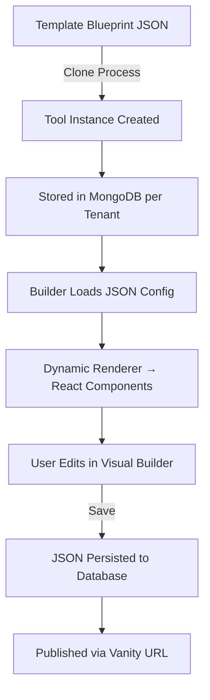

# 🚀 CodeAra — Micro SaaS Builder Platform

**CodeAra** is a full-stack, multi-tenant SaaS platform that allows users to create, customize, and deploy micro SaaS applications using predefined templates, a dynamic JSON-driven builder engine, and an immersive 3D cinematic landing experience.

> **From idea to deployed product — in one workflow.**

---

## 🎬 Interactive 3D Landing Page

The landing page is a cinematic, scroll-driven 3D experience built with **React Three Fiber** and **GSAP ScrollTrigger**. It tells the product story through motion:

**Idea → Build → Integrate → Launch**

| Stage | Scroll Range | Animation |
|---|---|---|
| **Hero Entry** | 0% | 3D panel floats with idle oscillation, headline + CTA visible |
| **Flatten** | 20–40% | Panel rotates flat on X-axis, camera shifts overhead |
| **Tool Integration** | 40–65% | 5 tool icons fly in and snap with spring bounce |
| **SaaS Assembly** | 65–82% | Dashboard UI materializes with glow pulse |
| **Launch** | 82–100% | Panel stands upright — complete product revealed |

Below the fold, the page continues with individually animated sections:
- **Features** — GSAP staggered entrance + icon micro-loops (pulse/float/spin)
- **How It Works** — Self-drawing timeline with scale-bounce nodes
- **Pricing** — rotateY flip-in cards with number roll on toggle
- **Testimonials** — Alternating slide-in with auto-cycling carousel
- **FAQ** — Smooth accordion with blue border highlight
- **Final CTA** — Animated gradient shift with word-by-word reveal

**Mobile (< 768px)**: WebGL replaced with CSS-only 2D fallback hero that auto-plays.

---

## 📐 Project Overview

CodeAra empowers developers and indie hackers to build production-ready micro SaaS products without writing boilerplate. The system separates **Templates** (blueprints) from **Tools** (instances), ensuring data integrity and scalability.

### Key Capabilities
- **Template Gallery** — Browse pre-built SaaS blueprints with live preview
- **One-Click Cloning** — Deep clone layouts, schemas, and configurations into a personal workspace
- **Visual Builder** — Drag-and-drop JSON-driven editor with real-time preview
- **Dynamic Rendering Engine** — Maps JSON types to React components at runtime
- **Multi-Tenant Isolation** — Every resource scoped by `tenantId` with middleware enforcement
- **Public App Deployment** — Publish and share SaaS apps via vanity URLs
- **Admin Panel** — Separate dashboard for marketplace moderation, user management, and analytics

---

## 🏗 Architecture

### Technology Stack

| Layer | Technologies |
|---|---|
| **Frontend** | React 19, Vite, Tailwind CSS, Framer Motion, React Three Fiber, Three.js, GSAP + ScrollTrigger |
| **Admin Frontend** | React 19, Vite, Tailwind CSS |
| **Backend** | Node.js, Express.js, Mongoose (MongoDB), JWT Auth, dotenv |
| **3D Engine** | React Three Fiber, @react-three/drei, Three.js, GSAP ScrollTrigger |
| **Database** | MongoDB with indexed tenant isolation |
| **Dev Tools** | Nodemon, Vite HMR, ESLint |

### System Flow


```mermaid
graph TD
    A[Template Blueprint JSON] -->|Clone Process| B[Tool Instance Created]
    B --> C[Stored in MongoDB per Tenant]
    C --> D[Builder Loads JSON Config]
    D --> E[Dynamic Renderer → React Components]
    E --> F[User Edits in Visual Builder]
    F -->|Save| G[JSON Persisted to Database]
    G --> H[Published via Vanity URL]
```

---

## 📁 Project Structure

```
Micro-SaaS-Builder-Platform/
├── frontend/                    # User-facing Application
│   └── src/
│       ├── components/
│       │   ├── 3d/              # Three.js / R3F Components
│       │   │   ├── Scene.jsx            # GSAP ScrollTrigger + R3F Canvas
│       │   │   ├── Panel.jsx            # 5-Stage animated 3D panel
│       │   │   ├── ImmersiveBackground.jsx  # Particle field background
│       │   │   └── FloatingModules.jsx  # Floating 3D SaaS modules
│       │   ├── dynamic/         # JSON Rendering Engine
│       │   │   ├── LayoutRenderer.jsx
│       │   │   ├── PageRenderer.jsx
│       │   │   ├── TemplateUIEngine.jsx
│       │   │   ├── ThemeEngine.jsx
│       │   │   ├── ToolRegistry.jsx
│       │   │   ├── NavbarLayout.jsx
│       │   │   └── SidebarLayout.jsx
│       │   ├── modules/         # SaaS Component Modules
│       │   │   ├── CrudTable.jsx
│       │   │   ├── KanbanBoard.jsx
│       │   │   ├── ChartDashboard.jsx
│       │   │   ├── CalendarView.jsx
│       │   │   └── MetricCards.jsx
│       │   └── layout/          # App Shell Components
│       │       ├── Navbar.jsx
│       │       ├── UserLayout.jsx
│       │       └── ProtectedRoute.jsx
│       ├── pages/               # Route-level Pages
│       │   ├── Landing.jsx          # Cinematic animated landing page
│       │   ├── Builder.jsx          # Visual drag-and-drop builder
│       │   ├── DashboardOverview.jsx
│       │   ├── Marketplace.jsx
│       │   ├── TemplateGallery.jsx
│       │   ├── PublicApp.jsx        # Public vanity URL renderer
│       │   ├── Tenants.jsx
│       │   ├── Analytics.jsx
│       │   ├── Subscriptions.jsx
│       │   ├── GlobalSettings.jsx
│       │   ├── Login.jsx
│       │   └── Register.jsx
│       ├── constants/
│       │   └── tools.js         # 3D animation tool definitions
│       ├── App.jsx
│       └── main.jsx
│
├── backend/                     # API Server
│   ├── config/                  # Database & environment config
│   ├── controllers/             # Business Logic
│   │   ├── authController.js
│   │   ├── toolController.js
│   │   ├── templateController.js
│   │   ├── dynamicController.js
│   │   ├── marketplaceController.js
│   │   ├── adminController.js
│   │   ├── analyticsController.js
│   │   ├── billingController.js
│   │   ├── tenantController.js
│   │   ├── userController.js
│   │   └── webhookController.js
│   ├── models/                  # Mongoose Schemas
│   │   ├── Template.js, Tool.js, TemplateClone.js
│   │   ├── User.js, Tenant.js, Admin.js
│   │   ├── Subscription.js, Review.js
│   │   ├── Theme.js, Webhook.js
│   ├── middlewares/             # Auth, Tenant, Analytics, Usage
│   ├── routes/                  # 11 API route files
│   ├── schema-engine/           # Dynamic schema compilation
│   ├── seeders/                 # Database seed scripts
│   └── server.js
│
└── admin-frontend/              # Admin Dashboard
    └── src/
        ├── pages/               # 11 admin pages
        ├── layouts/
        └── utils/
```

---

## 🗃 Database Models

| Model | Purpose |
|---|---|
| **Template** | Blueprint configs: `layoutJSON`, `schemaConfig`, `routeConfig`, `defaultPages`, `sampleData` |
| **Tool** | Cloned instances per tenant with `tenantId`, `templateId`, state (preview/live) |
| **TemplateClone** | Clone activity tracking for analytics and history |
| **User** | Authentication with JWT, profile, and role management |
| **Tenant** | Workspace isolation — every resource scoped to tenant |
| **Admin** | Admin-level users for marketplace moderation |
| **Subscription** | Plan management (Free / Pro / Team) |
| **Review** | User reviews and ratings for marketplace templates |
| **Theme** | Visual theme configs for tenant applications |
| **Webhook** | Event-driven integrations |

---

## 🧩 Dynamic Rendering Engine

The platform uses a **JSON-to-React** rendering pipeline:

```javascript
// Component Registry maps JSON types to React components
const componentRegistry = {
    CrudTable,      // Full CRUD data tables with search, sort, pagination
    KanbanBoard,    // Drag-and-drop kanban boards
    ChartDashboard, // Interactive charts with multiple visualization types
    CalendarView,   // Calendar with event management
    MetricCards,    // KPI metric cards with trend indicators
};
```

The `TemplateUIEngine` processes layout JSON → resolves components → renders a complete SaaS dashboard with sidebar navigation, theming, and responsive layouts.

---

## 🛡 Security & Performance

| Feature | Implementation |
|---|---|
| **Authentication** | JWT-based with secure httpOnly cookies |
| **Tenant Isolation** | Middleware enforces `tenantId` on every DB query |
| **RBAC** | Role-based access for admin, user, and public routes |
| **DB Indexing** | Indexes on `tenantId`, `slug`, `templateId` for fast queries |
| **Input Validation** | Express-validator on all API endpoints |
| **Rate Limiting** | Usage tracking middleware |
| **3D Performance** | DPR capped at 1.5, lazy-loaded Three.js, mobile 2D fallback |

---

## 🚀 Installation & Setup

### Prerequisites
- Node.js 18+
- MongoDB (local or Atlas URI)
- npm or yarn

### 1. Backend
```bash
cd backend
npm install
cp .env.example .env  # Configure MONGO_URI, JWT_SECRET, PORT
npm run dev            # Starts with nodemon on port 5000
```

### 2. Frontend
```bash
cd frontend
npm install
npm run dev            # Starts Vite on port 5173
```

### 3. Admin Panel
```bash
cd admin-frontend
npm install
npm run dev            # Starts Vite on port 5174
```

### Environment Variables (Backend `.env`)
```env
PORT=5000
MONGO_URI=mongodb://localhost:27017/saasforge
JWT_SECRET=your_jwt_secret
NODE_ENV=development
```

---

## 📊 API Routes

| Route Group | Endpoint Base | Description |
|---|---|---|
| Auth | `/api/v1/auth` | Register, Login, Token refresh |
| Tools | `/api/v1/tools` | CRUD for user tool instances |
| Templates | `/api/v1/templates` | Template management and cloning |
| Dynamic | `/api/v1/dynamic` | Dynamic schema operations |
| Marketplace | `/api/v1/marketplace` | Public template marketplace |
| Tenants | `/api/v1/tenants` | Tenant management |
| Users | `/api/v1/users` | User profile operations |
| Analytics | `/api/v1/analytics` | Usage and revenue metrics |
| Billing | `/api/v1/billing` | Subscription and payment management |
| Admin | `/api/v1/admin` | Admin dashboard operations |
| Webhooks | `/api/v1/webhooks` | Event-driven integrations |

---

## 🔮 Future Enhancements

- **Template Versioning** — Roll back to previous layout versions
- **Marketplace Monetization** — Payment processing for template creators
- **White-Label Support** — Custom domain mapping for tenant tools
- **Plugin System** — Third-party integrations via custom modules
- **AI-Powered Builder** — Natural language to SaaS configuration
- **Real-Time Collaboration** — Multi-user editing with WebSocket sync

---

## 👨‍💻 Author

**Mohammed Ansari**
*Full-Stack Developer & Engineering Student*

---

## 📄 License

This project is developed for academic and portfolio purposes.
