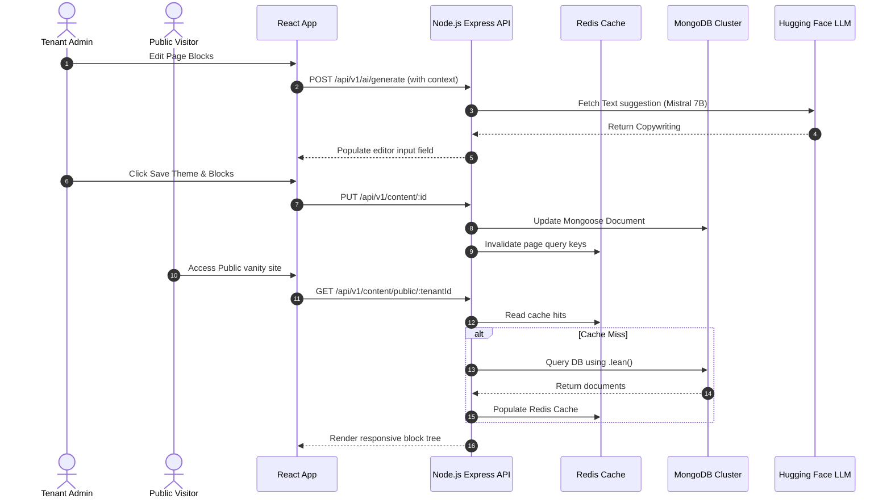
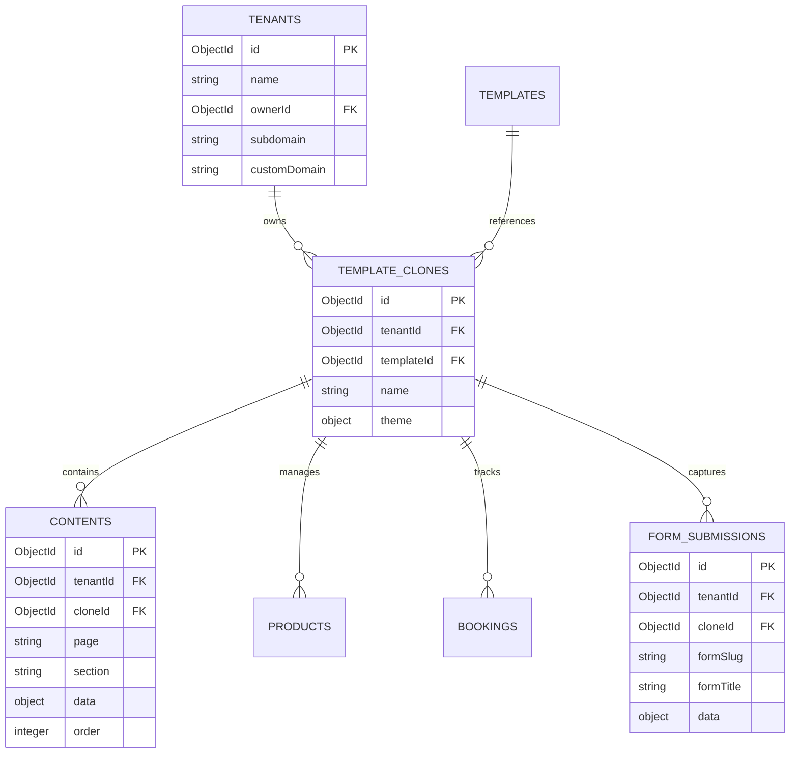
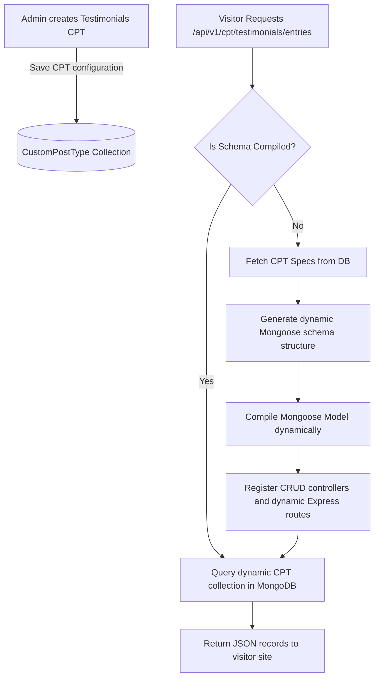

# 🚀 CodeAra — Enterprise Multi-Tenant Micro SaaS Builder Platform

**CodeAra** is a state-of-the-art, multi-tenant SaaS builder platform that enables users to create, configure, and publish customized micro-SaaS sites and tools in real-time. Built upon a **Template-Driven CMS Architecture**, CodeAra isolates tenant workspaces while introducing dynamic Gutenberg-style block layouts, dynamic Custom Post Types, active Redis query caching, and built-in Hugging Face LLM copywriting assistants.

---

## 📐 High-Level Architecture & User Flows

CodeAra divides tasks across three decoupled architectural components:
1.  **Frontend Engine**: A React 19 application containing the visual admin customized dashboard and template-based layout engines.
2.  **Core Node.js API Service**: The central Express.js platform handling user auth, template cloning, Gutenberg block CRUD, and Custom Post Type compilation.
3.  **Python Analytics Worker**: A FastAPI microservice executing database aggregates and compiling CSV reports.

### System Interaction Diagram

```mermaid
sequenceDiagram
    autonumber
    actor Admin as Tenant Admin
    actor Visitor as Public Visitor
    participant App as React App
    participant Api as Node.js Express API
    participant Cache as Redis Cache
    participant DB as MongoDB Cluster
    participant AI as Hugging Face LLM

    Admin->>App: Edit Page Blocks
    App->>Api: POST /api/v1/ai/generate (with context)
    Api->>AI: Fetch Text suggestion (Mistral 7B)
    AI-->>Api: Return Copywriting
    Api-->>App: Populate editor input field
    Admin->>App: Click Save Theme & Blocks
    App->>Api: PUT /api/v1/content/:id
    Api->>DB: Update Mongoose Document
    Api->>Cache: Invalidate page query keys
    
    Visitor->>App: Access Public vanity site
    App->>Api: GET /api/v1/content/public/:tenantId
    Api->>Cache: Read cache hits
    alt Cache Miss
        Api->>DB: Query DB using .lean()
        DB-->>Api: Return documents
        Api->>Cache: Populate Redis Cache
    end
    Api-->>App: Render responsive block tree
```

---

## 🗃 Database Collections & CPT Lazy Compiler

Below is the database entity-relationship schema showing how templates are cloned and isolated via `tenantId` + `cloneId`, and how Custom Post Types dynamically compile schemas:


```mermaid
erDiagram
    TENANTS ||--o{ TEMPLATE_CLONES : owns
    TEMPLATES ||--o{ TEMPLATE_CLONES : references
    TEMPLATE_CLONES ||--o{ CONTENTS : contains
    TEMPLATE_CLONES ||--o{ PRODUCTS : manages
    TEMPLATE_CLONES ||--o{ BOOKINGS : tracks
    TEMPLATE_CLONES ||--o{ FORM_SUBMISSIONS : captures
    
    TENANTS {
        ObjectId id PK
        string name
        ObjectId ownerId FK
        string subdomain
        string customDomain
    }
    
    TEMPLATE_CLONES {
        ObjectId id PK
        ObjectId tenantId FK
        ObjectId templateId FK
        string name
        object theme
    }

    CONTENTS {
        ObjectId id PK
        ObjectId tenantId FK
        ObjectId cloneId FK
        string page
        string section
        object data
        integer order
    }

    FORM_SUBMISSIONS {
        ObjectId id PK
        ObjectId tenantId FK
        ObjectId cloneId FK
        string formSlug
        string formTitle
        object data
    }
```

### Dynamic Custom Post Type Lazy Compiler Flow

```mermaid
graph TD
    A[Admin creates Testimonials CPT] -->|Save CPT configuration| B[(CustomPostType Collection)]
    C[Visitor Requests /api/v1/cpt/testimonials/entries] --> D{Is Schema Compiled?}
    D -->|No| E[Fetch CPT Specs from DB]
    E --> F[Generate dynamic Mongoose schema structure]
    F --> G[Compile Mongoose Model dynamically]
    G --> H[Register CRUD controllers and dynamic Express routes]
    D -->|Yes| I[Query dynamic CPT collection in MongoDB]
    I --> J[Return JSON records to visitor site]
    H --> I
```

---

## 📁 Comprehensive Folder & File Structure

Below is an exhaustive description of every file and folder in the project workspace:

```
Micro-SaaS-Builder-Platform/
│
├── backend/                             # Core Node.js API Service
│   ├── config/                          # Configuration files
│   │   ├── db.js                        # Establishes connection to MongoDB using Mongoose.
│   │   └── redis.js                     # Configures ioredis connection pool and export client instance.
│   │
│   ├── controllers/                     # Endpoint controllers (Request-Response Handlers)
│   │   ├── authController.js            # Registers, logs in users, and generates JWT tokens.
│   │   ├── bookingController.js         # Creates and manages tenant appointment booking records.
│   │   ├── contactController.js         # Receives contact form submissions and handles dynamic forms.
│   │   ├── cptController.js             # Handles CPT definitions and entry record creation.
│   │   ├── eventController.js           # Processes event management module listings and registration.
│   │   ├── orderController.js           # Manages orders, checkout items, and transaction logs.
│   │   ├── productController.js         # Implements CRUD for catalog product items.
│   │   ├── serviceController.js         # Manages salon/repair appointments and service durations.
│   │   ├── statsController.js           # Compiles clone stats (revenues, weekly totals, lead ratios).
│   │   └── templateController.js        # Clones templates, modifies layouts, and updates designs.
│   │
│   ├── middlewares/                     # Express Interceptor Middleware
│   │   ├── auth.js                      # Protects routes, parses JWTs, and sets req.tenantId.
│   │   ├── errorHandler.js              # Catch-all Express handler converting exceptions into clean JSON.
│   │   └── rateLimiter.js               # Enforces rate limiting rules to block API DDoS abuse.
│   │
│   ├── models/                          # Database Mongoose Schema blueprints
│   │   ├── Booking.js                   # Mapped fields for scheduled appointments.
│   │   ├── ContactMessage.js            # Standard direct message content representation.
│   │   ├── Content.js                   # Page content chunks containing block configurations.
│   │   ├── CustomPostType.js            # Blueprint schema configuration for dynamically generated models.
│   │   ├── Event.js                     # Mapped fields for upcoming events (date, venue).
│   │   ├── FormSubmission.js            # Holds unstructured key-value records from custom forms.
│   │   ├── Order.js                     # Cart items checkout totals and customer credentials.
│   │   ├── Product.js                   # Catalog items (names, prices, availability).
│   │   ├── Registration.js              # Event visitor registration records.
│   │   ├── Service.js                   # Catalog service items (durations, prices).
│   │   ├── Template.js                  # Master blueprints metadata (modules, categories, fonts).
│   │   └── Tenant.js                    # Workspace isolation credentials.
│   │
│   ├── routes/                          # Express endpoint path registrations
│   │   ├── authRoutes.js                # Mounts login, register, and identity check endpoints.
│   │   ├── aiRoutes.js                  # Maps generation requests to Hugging Face LLM helper.
│   │   ├── cptRoutes.js                 # Registers paths to fetch schemas and write CPT entries.
│   │   ├── statsRoutes.js               # Pulls aggregated analytics for charts.
│   │   └── ...                          # Direct route maps for each core module (product, order, etc).
│   │
│   ├── schema-engine/                   # Dynamic Schema compilation module
│   │   └── middleware.js                # Compiles tenant Mongoose schemas dynamically on request.
│   │
│   ├── seeders/                         # Master Database initialization scripts
│   │   ├── seedData.js                  # Defines default blocks, mock catalog products, and services.
│   │   └── templateSeeder.js            # Resets and seeds 12 template configurations in MongoDB.
│   │
│   ├── utils/                           # Core utilities
│   │   ├── ai.js                        # Interfaces with the Hugging Face Inference API.
│   │   └── hooks.js                     # WordPress-style Action & Filter Hooks Registry event bus.
│   │
│   ├── server.js                        # Service bootstrap file mounting routers, starting HTTP listeners.
│   └── package.json                     # Backend configuration dependencies.
│
├── frontend/                            # Front-End Web Application
│   ├── public/                          # Static assets and icons
│   └── src/
│       ├── components/                  
│       │   ├── layout/                  # Shell layouts (Navbar, Sidebar, Page wrappers)
│       │   ├── templates/               # Layout rendering engine
│       │   │   ├── TemplateRenderer.jsx # Main router and switch rendering sections.
│       │   │   ├── pages/               # Page styles (Generic, Menu, Cart, Book)
│       │   │   └── sections/            # Component sections (Hero, Hours, Highlights, CPT lists)
│       │   └── 3d/                      # Three.js / R3F landing animations
│       │
│       ├── context/                     # Global state context providers
│       │   ├── ContentContext.jsx       # Fetches vanity site pages and caches contents.
│       │   └── ThemeProvider.jsx        # Translates theme settings to browser-level CSS variables.
│       │
│       ├── pages/                       # User interfaces
│       │   ├── Landing.jsx              # Main GSAP/ScrollTrigger marketing homepage.
│       │   ├── PublicApp.jsx            # Dynamic page rendering vanity cloned sites.
│       │   ├── TemplateGallery.jsx      # Card-based gallery listing the 12 templates.
│       │   └── admin/                   # Visual Admin Panel Pages
│       │       ├── AnalyticsDashboard.js# Displays Recharts curves and histograms.
│       │       ├── ContentEditor.jsx    # visual Gutenberg block sidebar & side-by-side preview.
│       │       ├── CptManager.jsx       # Visual form builder to construct CPTs.
│       │       ├── TenantAdminLayout.jsx# Sidebar layout with menu page router.
│       │       ├── ThemeEditor.jsx      # Color preset selector, rounding inputs, and shadow style customizer.
│       │       └── ModuleManager.jsx    # Visual CRUD form for catalog items (products, bookings).
│       │
│       ├── App.jsx                      # Configures route path mapping and code splitting.
│       └── main.jsx                     # Render target mounting React virtual DOM.
│
└── polyglot-services/                   # Secondary Microservices
    └── python-analytics-worker/         # Analytics FastAPI Worker
        └── worker.py                    # Runs database aggregates and compiles reports.
```

---

## 📦 Installed Dependencies & Core Libraries

### 1. Backend Dependencies (`backend/package.json`)
*   **`mongoose` (v8.23.0)**: Object Document Mapper (ODM) used to validate data structure schemas, handle relational joins, and query MongoDB.
*   **`express` (v4.21.x)**: Fast, unopinionated minimalist web framework for routing and controller middleware.
*   **`jsonwebtoken` (v9.0.3)**: Generates and verifies cryptographic session tokens for user authentication.
*   **`bcryptjs` (v3.0.3)**: Cryptographic blowfish password hashing algorithm to secure credentials.
*   **`ioredis` (v5.9.3)**: Robust, performance-focused Redis client supporting connection pooling and async commands.
*   **`dotenv` (v17.3.1)**: Zero-dependency module that loads environment variables from a `.env` file into `process.env`.
*   **`cors` (v2.8.6)**: Enable cross-origin resource sharing to whitelist requests from the frontend port.
*   **`express-mongo-sanitize` (v2.2.0)**: Middleware which sanitizes user-supplied data to prevent MongoDB Operator Injection.
*   **`express-rate-limit` (v8.2.1)**: Rate limiting middleware to protect endpoints against brute-force attacks.
*   **`helmet` (v8.1.0)**: Secures Express apps by setting various HTTP response headers.
*   **`xss-clean` (v0.1.4)**: Middleware to sanitize user input in body, query, and params to prevent XSS.
*   **`axios` (v1.13.5)**: Promise-based HTTP client used to fetch copywriting responses from Hugging Face.
*   **`morgan` (v1.10.1)**: HTTP request logger middleware for node.js.
*   **`winston` (v3.19.0)**: A multi-transport logging library for tracking application logs.
*   **`bull` (v4.16.5)**: Redis-backed queue system for handling asynchronous background tasks.

### 2. Frontend Dependencies (`frontend/package.json`)
*   **`react` & `react-dom` (v19.2.0)**: Core UI library utilizing virtual DOM rendering.
*   **`react-router-dom` (v7.13.0)**: Declarative, component-based routing library.
*   **`recharts` (v3.7.0)**: SVG-driven chart rendering library used for generating analytics graphs.
*   **`framer-motion` (v12.34.3)**: Production-ready React animation library for cards and transitions.
*   **`gsap` (v3.14.2)**: High-performance green-sock animation library used for scroll-driven landing page animations.
*   **`three` (v0.183.2)** & **`@react-three/fiber` (v9.5.0)**: WebGL rendering engine and React wrapper for placing interactive 3D landing elements.
*   **`@react-three/drei` (v10.7.7)**: Helper components for configuring cameras, shaders, and materials.
*   **`lucide-react` (v0.575.0)**: Aesthetic vector-based icons.
*   **`lenis` (v1.3.17)** & **`@studio-freight/react-lenis` (v0.0.47)**: Physics-based smooth scrolling wrapper.
*   **`tailwindcss` (v4.2.1)** & **`@tailwindcss/vite` (v4.2.1)**: Utility-first CSS compiling framework.

---

## 🚀 Execution & Run Instructions

### 1. Build and Run the Node.js API Service
Ensure MongoDB is running, navigate to the `backend` directory, install packages, run seeders, and start the development server:
```bash
cd backend
npm install
node seeders/templateSeeder.js
npm run dev
```

### 2. Build and Run the React UI Application
Navigate to the `frontend` directory, install packages, and spin up the Vite development server:
```bash
cd frontend
npm install
npm run dev
```
Navigate to `http://localhost:5173` to interact with the platform.

### 3. Run the Python FastAPI Analytics Server
Ensure Python (v3.8+) is installed, navigate to the service folder, install FastAPI dependencies, and run:
```bash
cd polyglot-services/python-analytics-worker
pip install fastapi uvicorn pymongo
uvicorn worker:app --reload
```
This launches the secondary service on port `8000`. You can query real-time analytics at `http://localhost:8000/analytics/{tenant_id}`.
